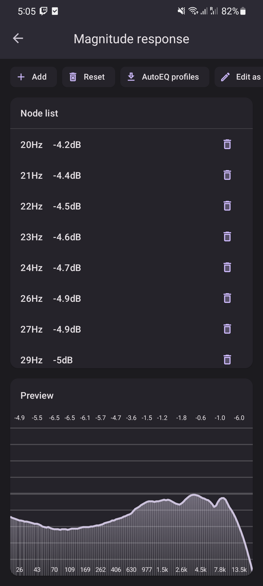

<h1 align="center">
  
   
  RootlessJamesDSP
   
</h1>
<h4 align="center">System-wide JamesDSP implementation for non-rooted Android devices</h4>

  
  
  
    

  <a href="#limitations">Limitations</a> •
  <a href="#spotify-support-patch">Spotify patch</a> •
  <a href="#downloads">Downloads</a> •
  <a href="#credits">Credits</a>

  

This app uses <a href="https://github.com/james34602/JamesDSPManager">libjamesdsp</a> which is written by <a href="https://github.com/james34602">James Fung (@james34602)</a>.

    This app has several limitations that may be deal-breaking to some people; please read this whole document before using the app.</i>

   
   

## Limitations
* Apps blocking internal audio capture remain unprocessed (e.g., Spotify, Google Chrome)
* Cannot coexist with (some) other audio effect apps (e.g., Wavelet and other apps that make use of the `DynamicsProcessing` Android API)
* Increased audio latency 

Apps confirmed working:
* YouTube
* YouTube Music
* Amazon Music
* Deezer
* Poweramp
* Substreamer
* Twitch
* Spotify ReVanced **(Patch required)**
* Apple Music
* ...

Unsupported apps include:
* Spotify (patch for Spotify exists)
* Google Chrome
* SoundCloud
* ...

Tested on:
* Samsung Galaxy S20+ (Android 12; OneUI 4.0)
* Stock AOSP emulator (Android 10-13)
* Google Pixel 6 Pro (Android 13)

## Spotify support patch
You can only use Spotify with this application if you patch the Spotify app.
The setup is very easy:

1. Download and install the [ReVanced manager APK](https://github.com/revanced/revanced-manager/releases) 
2. Install the unpatched Spotify app

NOTE: Tested with Spotify version `8.7.48.1062` and `8.7.68.568`

3. Open ReVanced Manager, select Spotify and enable the `disable-capture-restriction` patch.
4. Start the patching process and install the patched APK once it is done.
5. You can now use Spotify with RootlessJamesDSP.

## Translations

This application can be translated via Crowdin: https://crowdin.com/project/rootlessjamesdsp

Not all languages are enabled at the moment in Crowdin. To request a new language, please open an issue here on GitHub.

## Downloads

This app is available for free on Google Play: [https://play.google.com/store/apps/details?id=me.timschneeberger.rootlessjamesdsp](https://play.google.com/store/apps/details?id=me.timschneeberger.rootlessjamesdsp&utm_source=github&pcampaignid=pcampaignidMKT-Other-global-all-co-prtnr-py-PartBadge-Mar2515-1)

Also available on F-Droid: https://f-droid.org/packages/me.timschneeberger.rootlessjamesdsp/

## Using Root

This app focuses on a rootless implementation, but it can be made to work with the magisk module too. [See here for details](BUILD_ROOT.md).

All the limitations mentioned above are **not relevant** for the magisk/root version. 

## Credits

* JamesDSP - [James Fung (@james34602)](https://github.com/james34602)
* Theming system & backup system based on Tachiyomi

### Translators

<!-- CROWDIN-CONTRIBUTORS-START -->
<table>
  <tr>
    <td align="center" valign="top">
      <a href="https://crowdin.com/profile/ThePBone">
         
        <b>Tim Schneeberger (ThePBone)</b></a>
       
      <b>21948 words</b>
    </td>
    <td align="center" valign="top">
      <a href="https://crowdin.com/profile/netrunner-exe">
         
        <b>Oleksandr Tkachenko (netrunner-exe)</b></a>
       
      <b>6787 words</b>
    </td>
    <td align="center" valign="top">
      <a href="https://crowdin.com/profile/FrameXX">
         
        <b>FrameXX</b></a>
       
      <b>3351 words</b>
    </td>
    <td align="center" valign="top">
      <a href="https://crowdin.com/profile/rex07">
         
        <b>Rex_sa (rex07)</b></a>
       
      <b>3307 words</b>
    </td>
    <td align="center" valign="top">
      <a href="https://crowdin.com/profile/fankesyooni">
         
        <b>fankesyooni</b></a>
       
      <b>3291 words</b>
    </td>
    <td align="center" valign="top">
      <a href="https://crowdin.com/profile/beruanglaut">
         
        <b>Beruanglaut (beruanglaut)</b></a>
       
      <b>3165 words</b>
    </td>
  </tr>
  <tr>
    <td align="center" valign="top">
      <a href="https://crowdin.com/profile/hasandgn37">
         
        <b>MajorCanel (hasandgn37)</b></a>
       
      <b>2663 words</b>
    </td>
    <td align="center" valign="top">
      <a href="https://crowdin.com/profile/marcin.petrusiewicz">
         
        <b>Marcin Petrusiewicz (marcin.petrusiewicz)</b></a>
       
      <b>2360 words</b>
    </td>
    <td align="center" valign="top">
      <a href="https://crowdin.com/profile/SerAX3L">
         
        <b>Alessandro Belfiore (SerAX3L)</b></a>
       
      <b>1228 words</b>
    </td>
    <td align="center" valign="top">
      <a href="https://crowdin.com/profile/jont4">
         
        <b>Jontix (jont4)</b></a>
       
      <b>1073 words</b>
    </td>
    <td align="center" valign="top">
      <a href="https://crowdin.com/profile/TheGary">
         
        <b>Gary Bonilla (TheGary)</b></a>
       
      <b>1030 words</b>
    </td>
    <td align="center" valign="top">
      <a href="https://crowdin.com/profile/roccovantechno">
         
        <b>Gyuri Gergely (roccovantechno)</b></a>
       
      <b>714 words</b>
    </td>
  </tr>
  <tr>
    <td align="center" valign="top">
      <a href="https://crowdin.com/profile/pizzawithdirt">
         
        <b>Ali Yuruk (pizzawithdirt)</b></a>
       
      <b>639 words</b>
    </td>
    <td align="center" valign="top">
      <a href="https://crowdin.com/profile/Louis_Unnoficial">
         
        <b>Loui's (Louis_Unnoficial)</b></a>
       
      <b>513 words</b>
    </td>
    <td align="center" valign="top">
      <a href="https://crowdin.com/profile/ianpok17">
         
        <b>Criss Santiesteban (ianpok17)</b></a>
       
      <b>470 words</b>
    </td>
    <td align="center" valign="top">
      <a href="https://crowdin.com/profile/Na7M">
         
        <b>Na7M</b></a>
       
      <b>284 words</b>
    </td>
    <td align="center" valign="top">
      <a href="https://crowdin.com/profile/adrian_ek">
         
        <b>adrian_ek</b></a>
       
      <b>268 words</b>
    </td>
    <td align="center" valign="top">
      <a href="https://crowdin.com/profile/Tymwitko">
         
        <b>Tymwitko</b></a>
       
      <b>210 words</b>
    </td>
  </tr>
  <tr>
    <td align="center" valign="top">
      <a href="https://crowdin.com/profile/rabaimor">
         
        <b>rabaimor</b></a>
       
      <b>183 words</b>
    </td>
    <td align="center" valign="top">
      <a href="https://crowdin.com/profile/liziq">
         
        <b>zhiq liu (liziq)</b></a>
       
      <b>170 words</b>
    </td>
    <td align="center" valign="top">
      <a href="https://crowdin.com/profile/dev_trace">
         
        <b>dev_trace</b></a>
       
      <b>140 words</b>
    </td>
    <td align="center" valign="top">
      <a href="https://crowdin.com/profile/Jamil.M.Gomez">
         
        <b>Jamil M. Gomez (Jamil.M.Gomez)</b></a>
       
      <b>131 words</b>
    </td>
    <td align="center" valign="top">
      <a href="https://crowdin.com/profile/abrohim786">
         
        <b>ツ๛abrohim๛ (abrohim786)</b></a>
       
      <b>131 words</b>
    </td>
    <td align="center" valign="top">
      <a href="https://crowdin.com/profile/hdjhdjdhhd">
         
        <b>Đỗ Hải Anh (hdjhdjdhhd)</b></a>
       
      <b>119 words</b>
    </td>
  </tr>
  <tr>
    <td align="center" valign="top">
      <a href="https://crowdin.com/profile/Nlntendq">
         
        <b>Nlntendq</b></a>
       
      <b>75 words</b>
    </td>
    <td align="center" valign="top">
      <a href="https://crowdin.com/profile/Sanusi72">
         
        <b>Sanusi72</b></a>
       
      <b>71 words</b>
    </td>
    <td align="center" valign="top">
      <a href="https://crowdin.com/profile/Shiitake">
         
        <b>しいたけ (Shiitake)</b></a>
       
      <b>69 words</b>
    </td>
    <td align="center" valign="top">
      <a href="https://crowdin.com/profile/KnoyanMitsu">
         
        <b>Knoyan Mitsu (KnoyanMitsu)</b></a>
       
      <b>61 words</b>
    </td>
    <td align="center" valign="top">
      <a href="https://crowdin.com/profile/vbisoi">
         
        <b>vbisoi</b></a>
       
      <b>60 words</b>
    </td>
    <td align="center" valign="top">
      <a href="https://crowdin.com/profile/trmatii">
         
        <b>Matias Cortes (trmatii)</b></a>
       
      <b>51 words</b>
    </td>
  </tr>
  <tr>
    <td align="center" valign="top">
      <a href="https://crowdin.com/profile/michelequercetti">
         
        <b>michele quercetti (michelequercetti)</b></a>
       
      <b>50 words</b>
    </td>
    <td align="center" valign="top">
      <a href="https://crowdin.com/profile/Iepurooy">
         
        <b>Ant. Rares (Iepurooy)</b></a>
       
      <b>45 words</b>
    </td>
  </tr>
</table><a href="https://crowdin.com/project/rootlessjamesdsp" target="_blank">Translate in Crowdin 🚀</a>
<!-- CROWDIN-CONTRIBUTORS-END -->
